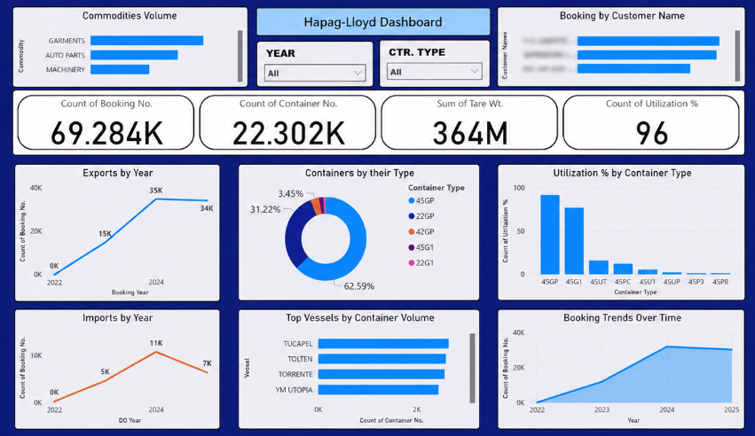
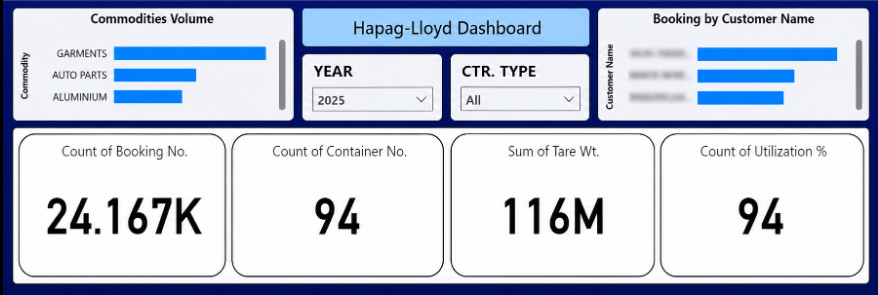
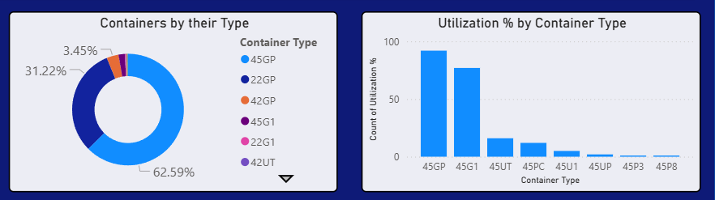
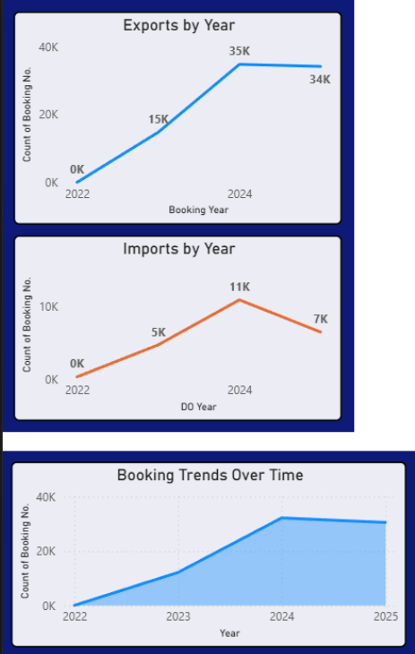
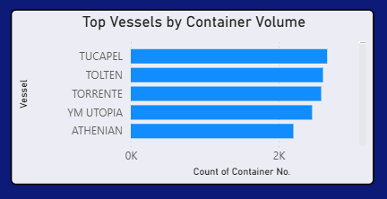

# Hapag-Lloyd-Logistics-Analytics-Dashboard
Logistics analytics dashboard built with Power BI to monitor shipment trends, container utilization, customer activity, and operational performance.

## Project Overview

This project focuses on the analysis and visualization of large-scale logistics data through an interactive Power BI dashboard. The dashboard was designed to provide operational visibility into shipment activity, container utilization, customer bookings, commodity movement, and vessel performance.

The dataset consists of more than 500,000 logistics records collected between April 2022 and October 2025. By transforming raw operational data into meaningful business insights, the dashboard enables stakeholders to monitor key performance indicators, identify trends, and support data-driven decision-making.

## Business Objective

Logistics operations generate large volumes of shipment and container-related data that can be difficult to monitor through traditional reporting methods. The objective of this dashboard is to centralize critical operational metrics and provide an intuitive analytical interface for exploring:

- Shipment and booking trends
- Container utilization patterns
- Commodity-wise movement volumes
- Customer booking activity
- Vessel performance metrics
- Operational KPIs

The dashboard allows users to quickly identify changes in operational performance and gain insights into logistics activity across multiple dimensions.

---

## Dataset Information

### Dataset Size
- Over 500,000 records

### Time Period
- April 2022 to October 2025

### Data Domain
- Logistics and Shipping Operations

### Key Data Elements
- Booking Numbers
- Container Numbers
- Container Types
- Commodity Categories
- Customer Information
- Vessel Information
- Shipment Dates
- Utilization Metrics
- Tare Weight Information

---

## Tools & Technologies

### Data Analysis
- Microsoft Excel
- SQL

### Data Visualization
- Power BI

### Techniques Applied
- Data Cleaning
- Data Transformation
- KPI Development
- Trend Analysis
- Business Reporting
- Dashboard Design
- Interactive Filtering

---

## Key Performance Indicators (KPIs)

The dashboard tracks several operational metrics including:

### Booking Metrics
- Total Booking Count

### Container Metrics
- Total Container Count
- Container Type Distribution
- Container Utilization Percentage

### Weight Metrics
- Total Tare Weight

### Operational Metrics
- Import Activity
- Export Activity
- Vessel Performance
- Customer Activity
- Commodity Distribution

---

## Dashboard Features

### Interactive Filtering

Users can dynamically filter data by:

- Year
- Container Type

### Commodity Analysis

Provides visibility into the movement volume of different commodity categories and identifies the highest-volume commodities.

### Customer Analysis

Tracks booking activity across customers and highlights major contributors to shipment volume.

### Container Analysis

Analyzes:

- Container type distribution
- Utilization percentages
- Operational usage trends

### Import & Export Trends

Visualizes yearly shipment activity and highlights changes in import and export volumes over time.

### Vessel Performance Analysis

Identifies vessels handling the highest container volumes and supports operational performance monitoring.

### Booking Trend Analysis

Tracks shipment growth patterns and booking activity across the entire analysis period.

---

## Insights Generated

The dashboard enables users to:

- Monitor operational performance in real time
- Analyze shipment trends over multiple years
- Evaluate container utilization efficiency
- Identify high-volume customers and commodities
- Compare import and export activity
- Assess vessel-level performance
- Support strategic and operational decision-making

---

## Dashboard Preview

### Overview Dashboard



### Commodity Analysis



### Container Analysis



### Trend Analysis



### Vessel Performance



---

## Repository Structure

```
Hapag-Lloyd-Logistics-Analytics-Dashboard
│
├── README.md
│
└── Screenshots
    ├── dashboard-overview.png
    ├── commodity-analysis.png
    ├── container-analysis.png
    ├── trend-analysis.png
    └── vessel-performance.png
```

---

## Disclaimer

This repository is intended solely for portfolio and educational purposes. Any confidential, proprietary, or sensitive business information has been removed or anonymized. The project is presented to demonstrate data analysis, business intelligence, and dashboard development capabilities.
